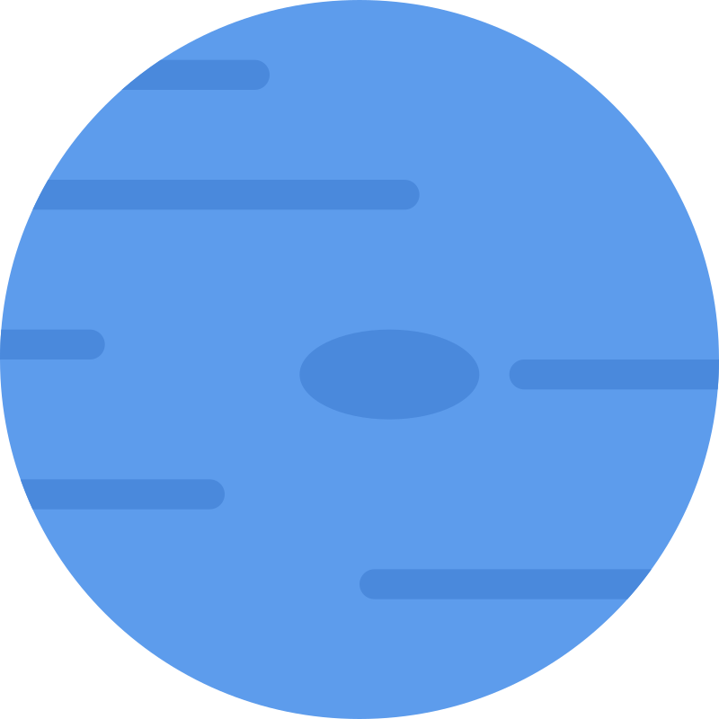

<div align="center">
    
    <h1>Neptune TV</h1>
    <em>Blazing-Fast IPTV M3U8 Player</em>
    <p></p>
</div>

Neptune TV is a desktop IPTV application engineered for speed. Unlike traditional players that struggle with large
playlists, Neptune uses a Rust-driven SQLite core to index and filter millions of entries instantly.

## Why

most IPTV players (like VLC or Web-based ones) lag or crash when loading a 40MB M3U8 file.

## Key Features

- _Rust Core_: Blazing fast M3U8 parsing and data management.
- _Low Footprint_: Uses the native OS WebView—tiny binary size, minimal RAM usage.
- _Massive Playlist Support_: Smoothly handles files with 1M+ entries via SQLite indexing.
- _Group Virtualization_: Instant scrolling through thousands of categories.
- _Global Search_: Find any channel in milliseconds.
- _Cross-Platform_: Runs on Windows, macOS, and Linux.
- _External playback_: HLS, M3U/DASH manifests, and `rtsp`/`rtmp`/`srt`–style stream URLs try **VLC** when it is installed; other URLs use the OS default handler.

## Tech Stack

- _Framework_: Tauri
- _Backend_: Rust (for parsing and DB)
- _Database_: SQLite (local persistence)
- _Frontend_: React + TypeScript + Tailwind CSS with shadcn/ui
- _List Rendering_: TanStack Virtual

---

## Requirements

- [Node.js](https://nodejs.org/) (LTS recommended)
- [Rust](https://www.rust-lang.org/tools/install) (stable toolchain; `clippy` + `rustfmt` recommended)
- [Yarn](https://yarnpkg.com/) 4.x (Berry)

## Development

```shell
yarn install
```

- **Full app (Tauri + Vite):** `yarn tauri dev`
- **Frontend only (mock adapter):** `yarn dev`
- **Tests:** `yarn test`
- **Lint:** `yarn lint` · **Typecheck:** `yarn typecheck`
- **Rust:** from `src-tauri/`: `cargo clippy --all-targets -- -D warnings` · `cargo test` · `cargo fmt --check`

## Build

Production bundle (installers per platform):

```shell
yarn tauri build
```

Artifacts are emitted under `src-tauri/target/release/` and platform-specific bundle outputs (e.g. `.dmg`, `.msi`).

## Documentation

- Product and behaviour: [`FEATURES.md`](FEATURES.md)
- Engineering reference: [`CLAUDE.md`](CLAUDE.md)

## License

This project is licensed under the GNU General Public License v3.0 — see [`LICENSE`](LICENSE).
